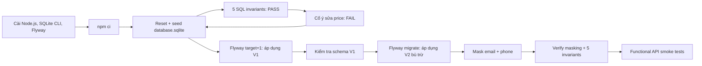

# EShop Database Testing Lab Manual

> Mục tiêu: sau khi hoàn thành, một nhóm khác có thể tự cài môi trường, reset/seed EShop, chạy **đúng 5 SQL invariant tests** (có cả PASS và FAIL), chạy và kiểm chứng migration/rollback mô phỏng, mask `users.email`/`users.phone`, rồi smoke-test lại database và API. Lab còn có một demo MongoDB/NoSQL tương ứng: collection validation, Faker JSON, insert lỗi, masking và query sau masking.

> Phạm vi an toàn: toàn bộ lệnh tác động dữ liệu trong tài liệu chỉ dùng cho **SQLite local** `backend/database.sqlite` và database MongoDB local `eshop_nosql_lab`. `reset-db` và `db.dropDatabase()` xóa dữ liệu local hiện có. Không dùng các lệnh này với dữ liệu thật/production.

## 1. Bản đồ lab



*Hình 1 — Chuỗi thao tác của lab. Các nút quay về Reset là chủ đích: dữ liệu phải luôn xác định trước mỗi phần kiểm thử.*

## 2. Điều kiện đầu vào và cài công cụ từ đầu

| Công cụ | Dùng để làm gì | Kiểm tra sau khi cài |
| --- | --- | --- |
| Git | lấy mã nguồn | `git --version` |
| Node.js LTS **>= 20.19** và npm >= 10 | backend, Faker, frontend | `node --version` và `npm --version` |
| SQLite CLI 3 | chạy SQL, xem schema | `sqlite3 --version` |
| Flyway CLI | chạy migration | `flyway -v` |
| Docker Desktop + MongoDB 8 (hoặc MongoDB Community + mongosh) | demo NoSQL local ở phần 8 | `docker --version`; `docker exec eshop-mongo mongosh --version` |
| `curl` | functional smoke test API | `curl --version` |

### 2.1 Cài đặt

1. Cài **Node.js LTS** từ [trang Download chính thức của Node.js](https://nodejs.org/en/download). Máy lab hiện dùng Node 22.17; dùng Node **20.19+** (hoặc Node 22 LTS) vì `@faker-js/faker@10.5.0` trong `package-lock.json` khai báo engine Node từ 20.19. `README` cũ ghi >=18, nhưng mức đó không đủ để bảo đảm chạy được masking hiện tại.
2. Cài SQLite CLI. macOS có thể dùng Homebrew: `brew install sqlite`; Ubuntu/Debian: `sudo apt install sqlite3`. Trên Windows, tải **sqlite-tools** từ [trang tải chính thức SQLite](https://www.sqlite.org/download.html), giải nén và thêm thư mục chứa `sqlite3.exe` vào `PATH`.
3. Cài Flyway CLI theo [hướng dẫn cài đặt chính thức](https://documentation.red-gate.com/flyway/reference/usage/command-line): tải gói CLI cho hệ điều hành, giải nén và thêm thư mục chứa `flyway`/`flyway.cmd` vào `PATH`. Trên macOS có Homebrew, `brew install flyway` là lựa chọn tiện dụng.
4. Kiểm tra lại tất cả các lệnh trong cột thứ ba ở bảng trên. Nếu lệnh nào báo `command not found`, đóng/mở lại terminal sau khi cập nhật `PATH`.

### 2.2 Lấy mã nguồn và cài dependencies

Thay `<repo-url>` bằng URL repository được nhóm cung cấp. Nếu đã mở đúng thư mục dự án, bỏ qua hai lệnh `git`/`cd` đầu.

```bash
git clone <repo-url> eshop-sut
cd eshop-sut
npm ci
cd backend
npm ci
```

`npm ci` dùng đúng phiên bản đã khóa trong `package-lock.json`. Lệnh ở thư mục gốc rất quan trọng vì package `@faker-js/faker`, được script masking sử dụng, được khai báo tại `package.json` gốc.

Kiểm tra cấu hình migration trước khi làm tiếp:

```bash
cat flyway.conf
flyway -configFiles=flyway.conf info
```

Bạn đang ở `backend/` từ bước cài dependency. Kết quả phải chỉ tới `jdbc:sqlite:database.sqlite` và location `filesystem:migration`. Flyway đọc đường dẫn tương đối theo **thư mục hiện tại**, vì vậy mọi lệnh Flyway trong tài liệu này đều phải chạy tại `backend/`.

## 3. Reset và seed database EShop

Tại `backend/`, dừng server Node nếu đang chạy (nhấn `Ctrl+C` ở terminal chạy server), sau đó:

```bash
npm run reset-db
sqlite3 database.sqlite "SELECT 'users' AS table_name, COUNT(*) AS rows FROM users
UNION ALL SELECT 'products', COUNT(*) FROM products
UNION ALL SELECT 'orders', COUNT(*) FROM orders
UNION ALL SELECT 'coupons', COUNT(*) FROM coupons;"
```

Kết quả mong đợi sau seed hiện tại:

```text
users|2
products|18
orders|10
coupons|4
```

Tài khoản seed thực tế là:

| Vai trò | Email | Mật khẩu |
| --- | --- | --- |
| Admin | `admin@eshop.com` | `Admin123!` |
| User | `test@eshop.com` | `Test1234!` |

> Lưu ý: `setup_guide.md` ghi `admin123` cho admin, nhưng dữ liệu nguồn [`backend/seed-data.json`](backend/seed-data.json) ghi `Admin123!`. Trong lab phải tin dữ liệu seed.

**Ảnh minh họa terminal — reset thành công**

```text
$ npm run reset-db
Removed existing database file: .../backend/database.sqlite
Connected to database
Database initialized and seeded from seed-data.json.
Database reset and seeded from seed-data.json.

$ sqlite3 database.sqlite "SELECT COUNT(*) FROM products;"
18
```

## 4. Chạy đủ 5 SQL invariant tests

**Invariant** là điều phải luôn đúng với database. Một query trả `PASS` khi số bản ghi vi phạm là `0`; không dùng việc “query không lỗi” làm bằng chứng dữ liệu đúng.

Chạy nguyên khối sau tại `backend/`. Đây là **5 test** độc lập, mỗi dòng kết quả tương ứng một invariant.

```bash
sqlite3 -header -box database.sqlite <<'SQL'
SELECT
  'INV-01: product price is positive' AS test,
  CASE WHEN COUNT(*) = 0 THEN 'PASS' ELSE 'FAIL' END AS status,
  COUNT(*) AS violating_rows
FROM products
WHERE price IS NULL OR price <= 0;

SELECT
  'INV-02: product has existing category' AS test,
  CASE WHEN COUNT(*) = 0 THEN 'PASS' ELSE 'FAIL' END AS status,
  COUNT(*) AS violating_rows
FROM products p
LEFT JOIN categories c ON c.id = p.category_id
WHERE p.category_id IS NULL OR c.id IS NULL;

SELECT
  'INV-03: order has existing user' AS test,
  CASE WHEN COUNT(*) = 0 THEN 'PASS' ELSE 'FAIL' END AS status,
  COUNT(*) AS violating_rows
FROM orders o
LEFT JOIN users u ON u.id = o.user_id
WHERE o.user_id IS NULL OR u.id IS NULL;

SELECT
  'INV-04: coupon usage has coupon and user' AS test,
  CASE WHEN COUNT(*) = 0 THEN 'PASS' ELSE 'FAIL' END AS status,
  COUNT(*) AS violating_rows
FROM coupon_usage cu
LEFT JOIN coupons c ON c.id = cu.coupon_id
LEFT JOIN users u ON u.id = cu.user_id
WHERE cu.coupon_id IS NULL OR c.id IS NULL OR cu.user_id IS NULL OR u.id IS NULL;

WITH invalid_email AS (
  SELECT COUNT(*) AS n
  FROM users
  WHERE email IS NULL OR TRIM(email) = '' OR email NOT LIKE '%_@_%._%'
), duplicate_email AS (
  SELECT COUNT(*) AS n
  FROM (SELECT email FROM users GROUP BY email HAVING COUNT(*) > 1)
)
SELECT
  'INV-05: user email is present, shaped, unique' AS test,
  CASE WHEN (SELECT n FROM invalid_email) + (SELECT n FROM duplicate_email) = 0
       THEN 'PASS' ELSE 'FAIL' END AS status,
  (SELECT n FROM invalid_email) + (SELECT n FROM duplicate_email) AS violating_rows;
SQL
```

Kết quả mong đợi ngay sau reset là 5 dòng `PASS` và `violating_rows` đều bằng `0`.

| ID | Điều mà test phát hiện | Vì sao cần test ở mức DB |
| --- | --- | --- |
| INV-01 | giá sản phẩm rỗng/không dương | UI validation có thể bị bỏ qua khi gọi API trực tiếp |
| INV-02 | product mồ côi category | schema hiện không khai báo foreign key cho quan hệ này |
| INV-03 | order mồ côi user | bảo vệ báo cáo/lịch sử đơn hàng |
| INV-04 | coupon usage tham chiếu dữ liệu không tồn tại | bảo vệ tính đúng đắn của giới hạn coupon |
| INV-05 | email rỗng, sai dạng đơn giản hoặc trùng | `users.email` hiện không có `UNIQUE`/`NOT NULL` trong schema |

### 4.1 Bắt buộc quan sát một test FAIL

Không đủ để chỉ có test xanh. Cố ý làm hỏng dữ liệu test, chạy lại test INV-01, rồi reset để khôi phục:

```bash
sqlite3 database.sqlite "UPDATE products SET price = 0 WHERE id = 1;"
sqlite3 -header -box database.sqlite "
  SELECT 'INV-01: product price is positive' AS test,
         CASE WHEN COUNT(*) = 0 THEN 'PASS' ELSE 'FAIL' END AS status,
         COUNT(*) AS violating_rows
  FROM products
  WHERE price IS NULL OR price <= 0;"
```

**Ảnh minh họa terminal — bằng chứng test phát hiện lỗi**

```text
┌─────────────────────────────────────┬────────┬────────────────┐
│ test                                │ status │ violating_rows │
├─────────────────────────────────────┼────────┼────────────────┤
│ INV-01: product price is positive   │ FAIL   │ 1              │
└─────────────────────────────────────┴────────┴────────────────┘
```

Khôi phục **ngay** bằng reset (đồng thời xóa luôn lịch sử Flyway của file SQLite vừa reset):

```bash
npm run reset-db
```

Chạy lại khối 5 test ở phần 4; cả 5 phải trở về `PASS` trước khi làm migration.

## 5. Chạy migration và mô phỏng rollback có kiểm chứng

### 5.1 Hiểu migration của repository này

- `V1__standardize_schema_column_names_and_add_audit_log.sql` đổi tên nhiều cột, thêm bảng `audit_logs` và 5 index.
- `V2__rollback_standardize_schema_column_names_and_drop_audit_log.sql.sql` là **forward/compensating migration**: nó xóa phần thêm ở V1 và đổi tên cột trở lại như schema ban đầu.
- Tên file V2 có hậu tố `.sql.sql` trong repository. Flyway hiện vẫn nhận diện nó; **không tự đổi tên file đã được áp dụng**, vì metadata/description trong `flyway_schema_history` có thể không còn khớp. Nếu cần sửa tên, lập kế hoạch migration mới hoặc dùng quy trình `repair` được review, không làm giữa lab.

Vì V1 đổi `phone` thành `phone_number`, `imageUrl` thành `image_url`, ... nên backend hiện tại (vẫn query tên cột cũ) không tương thích với schema ở version 1. Chỉ khởi động backend **sau khi V2 hoàn tất**.

### 5.2 Áp dụng V1 và kiểm tra trạng thái thay đổi

Sau reset ở phần 4, database là schema cũ và chưa có Flyway history. Áp dụng đến version 1, không đi tiếp V2:

```bash
flyway -configFiles=flyway.conf -target=1 migrate
flyway -configFiles=flyway.conf info
sqlite3 database.sqlite ".schema users"
sqlite3 database.sqlite ".schema products"
sqlite3 database.sqlite ".tables audit_logs"
```

Kết quả cần ghi nhận:

| Kiểm tra | Dấu hiệu V1 đã chạy |
| --- | --- |
| `info` | baseline `0` và version `1` có state `Success`; V2 còn `Pending` |
| `.schema users` | có `phone_number`, không còn `phone` |
| `.schema products` | có `image_url`, không còn `imageUrl` |
| `.tables audit_logs` | hiển thị `audit_logs` |

`-target=1` bảo Flyway chỉ chạy các versioned migration tới và gồm version 1; đây là cách quan sát V1 trước khi V2 được chạy. Theo tài liệu Flyway, `migrate` bình thường áp dụng migration pending theo thứ tự và `target` giới hạn version đích.

### 5.3 Mô phỏng rollback bằng V2 và kiểm chứng schema

Chạy migration bình thường để V2 được áp dụng như một migration tiến mới:

```bash
flyway -configFiles=flyway.conf migrate
flyway -configFiles=flyway.conf validate
flyway -configFiles=flyway.conf info
sqlite3 database.sqlite ".schema users"
sqlite3 database.sqlite ".schema products"
sqlite3 database.sqlite ".tables audit_logs"
sqlite3 database.sqlite "SELECT version, description, success FROM flyway_schema_history ORDER BY installed_rank;"
```

**Tiêu chí pass cho rollback mô phỏng:**

- `phone` và `imageUrl` xuất hiện lại trong schema; `phone_number`/`image_url` không còn.
- `.tables audit_logs` không in ra `audit_logs`.
- `validate` kết thúc thành công và `info` cho version `2` là `Success`.
- `flyway_schema_history` giữ audit trail baseline 0, V1 và V2; không xóa lịch sử V1.

```text
Trước V2: users.phone_number + products.image_url + audit_logs
Sau  V2: users.phone        + products.imageUrl  + (không audit_logs)
```

Đây là **mô phỏng rollback**, không phải `flyway undo`. `flyway undo` là tính năng Flyway Teams, còn dự án đang dùng Flyway OSS; vì vậy V2 là cách an toàn, truy vết được để trả schema về tương thích với backend. Khi migration có thao tác phá hủy dữ liệu, phải có backup/restore đã thử nghiệm; migration bù trừ không tự khôi phục dữ liệu đã bị xóa.

## 6. Mask `users.email` và `users.phone`, rồi kiểm tra dữ liệu

Chỉ thực hiện phần này khi V2 đã hoàn tất, vì script masking đang query cột `phone` gốc. Trong phần kiểm tra database này, giữ backend Node đang dừng để tránh một restart bất ngờ làm seed lại database, rồi chạy:

```bash
npm run mask-data
node verify_masking.js
sqlite3 -header -box database.sqlite "SELECT id, name, email, phone FROM users ORDER BY id;"
```

Ví dụ đầu ra (chuỗi Faker là ngẫu nhiên nên không cần trùng y hệt):

```text
===== BEFORE =====
[1] admin@eshop.com | (null)
[2] test@eshop.com | (null)

===== AFTER =====
[1] user1_aB39xQ@faker.test | 0912345678
[2] user2_k8LmN2@faker.test | 0987654321

Data masking completed successfully.

========== VERIFY ==========
Total users: 2
Null email: PASS
Null phone: PASS
Duplicate email: PASS
Masked email: PASS
```

Script chạy `BEGIN TRANSACTION` và `COMMIT`; nếu một update lỗi, nhánh lỗi gọi `ROLLBACK`. Nó chỉ thay `email` và `phone`, không thay `id`, `role`, `password`, orders hay coupon usage.

Tiếp tục chạy lại **khối 5 SQL invariant tests ở phần 4**. Mọi test phải `PASS`; INV-05 vẫn đúng vì địa chỉ mới có hậu tố `@faker.test` và là duy nhất. Kiểm tra database-level bổ sung cho masking:

```bash
sqlite3 -header -box database.sqlite "
SELECT
  COUNT(*) AS total_users,
  SUM(email LIKE '%@faker.test') AS masked_emails,
  SUM(phone GLOB '09[0-9][0-9][0-9][0-9][0-9][0-9][0-9][0-9]') AS valid_masked_phones
FROM users;"
```

Kết quả mong đợi: `total_users = masked_emails = valid_masked_phones = 2`.

> Masking là không đảo ngược được trong lab này: reset/seed là cách quay về email gốc. Không commit `database.sqlite` đã mask nếu nó chứa dữ liệu ngoài dữ liệu mẫu.

## 7. Chạy lại functional và database tests sau masking

Repository chưa có automated test runner: `backend/package.json` đặt `npm test` thành lệnh báo lỗi “no test specified”. Vì vậy lab dùng (1) 5 database invariants ở phần 4 và (2) functional API smoke test bên dưới. Đây là giới hạn hiện tại cần ghi rõ, không được báo cáo nhầm là một Jest/Mocha suite đã chạy.

### 7.1 Khởi động backend

Mở terminal A tại `backend/`:

```bash
npm run dev
```

Chờ dòng `Server is running on http://localhost:3000` (hoặc thông báo server tương đương). Do `server.js` import `database.js`, database sẽ được tạo lại/seed mỗi lần khởi động server. Điều đó làm mất masking đã kiểm tra ở phần 6. Vì functional test bên dưới phải quan sát PII đã mask, **không restart Terminal A nữa** và mở Terminal B tại `backend/` để mask lại ngay:

```bash
npm run mask-data
node verify_masking.js
```

Kết quả phải có 4 dòng `PASS`. SQLite cho phép process server mở kết nối khi không có transaction; nếu hiếm khi gặp `SQLITE_BUSY`, dừng server, khởi động lại, rồi lặp ngay hai lệnh trên trước khi test API.

### 7.2 Functional smoke test dùng user đã mask

Mở terminal B tại `backend/`. Không dùng `test@eshop.com` nữa: email đó đã bị thay. Lấy email của user id 2, login bằng mật khẩu seed không đổi, rồi gọi API:

```bash
USER_EMAIL="$(sqlite3 database.sqlite 'SELECT email FROM users WHERE id = 2;')"
TOKEN="$(curl -sS -X POST http://localhost:3000/api/login \
  -H 'Content-Type: application/json' \
  -d "{\"email\":\"$USER_EMAIL\",\"password\":\"Test1234!\"}" \
  | node -pe "JSON.parse(require('fs').readFileSync(0, 'utf8')).token")"

curl -i http://localhost:3000/api/cart
curl -sS -H "Authorization: Bearer $TOKEN" http://localhost:3000/api/users/me
curl -sS http://localhost:3000/api/products
```

| Request | Kết quả mong đợi | Bằng chứng chức năng |
| --- | --- | --- |
| `GET /api/cart` không token | `HTTP/1.1 401` | endpoint bảo vệ route |
| `GET /api/users/me` có token | JSON user id 2, `email` kết thúc `@faker.test`, `phone` 10 số bắt đầu `09` | login vẫn hoạt động với PII đã mask |
| `GET /api/products` | JSON mảng 18 products | read API vẫn hoạt động sau V2/masking |

Sau smoke test, chạy lại khối 5 SQL invariants một lần cuối và lưu terminal output vào báo cáo lab. Điều kiện hoàn thành: **5 PASS + verify_masking 4 PASS + API profile trả PII đã mask**.

## 8. Bổ sung lab NoSQL — MongoDB `users`

MongoDB được chọn thay vì Redis vì document `users` có các trường tương đương trực tiếp với bảng `users` của EShop. Đây là **demo NoSQL độc lập**, dùng dữ liệu Faker hoàn toàn giả; backend EShop hiện vẫn chạy SQLite và không tự đọc MongoDB. Không dùng database này để thay thế database production.

```mermaid
flowchart LR
    A[Khởi động MongoDB local] --> B[Reset eshop_nosql_lab]
    B --> C[Tạo collection users + validator]
    C --> D[Node + Faker sinh users.json]
    D --> E[Import 5 documents]
    E --> F[Thử insert sai: MongoDB từ chối]
    F --> G[Mask email + phone]
    G --> H[Query và invariant sau masking]
    H -. tùy chọn .-> I[Flyway MongoDB migration riêng]
```



*Hình 2 — Demo NoSQL tương ứng 8 đầu việc: validation, dữ liệu giả, failure có chủ đích, masking, query và migration tùy chọn.*

### 8.1 Khởi động MongoDB local

Phương án ít phụ thuộc nhất là Docker Desktop. Sau khi Docker đang chạy, tại **root của repository**, chạy:

```bash
docker run --name eshop-mongo -d \
  -p 127.0.0.1:27018:27017 \
  -v eshop-mongo-data:/data/db \
  mongo:8

docker ps --filter name=eshop-mongo
docker exec eshop-mongo mongosh --version
```

`127.0.0.1:27018:27017` chỉ mở MongoDB trên máy local; dùng host port `27018` để không đụng MongoDB local hay service khác thường chiếm `27017`. Nếu container đã tồn tại nhưng đang dừng, dùng `docker start eshop-mongo`; không chạy lại `docker run` với cùng tên. Có thể thay Docker bằng MongoDB Community Server và mongosh cài local, nhưng toàn bộ lệnh bên dưới giả định URI local `mongodb://127.0.0.1:27018`.

Để import file JSON ở bước sau, cài **MongoDB Database Tools** để có `mongoimport` (kiểm tra bằng `mongoimport --version`). Đây là bộ công cụ riêng; MongoDB Server/Docker image không bảo đảm có binary đó trên máy host. Xem [hướng dẫn cài Database Tools chính thức](https://www.mongodb.com/docs/database-tools/installation/).

### 8.2 Reset database NoSQL và tạo collection có validation

`dropDatabase()` phá hủy toàn bộ database `eshop_nosql_lab`; chỉ chạy với lab local. Mở shell MongoDB trong container:

```bash
docker exec -it eshop-mongo mongosh "mongodb://localhost:27017/eshop_nosql_lab"
```

Trong prompt `test>`/`eshop_nosql_lab>`, dán khối sau. Hai lệnh đầu reset sạch để lab luôn tái lập được.

```javascript
db.dropDatabase();

db.createCollection("users", {
  validator: {
    $jsonSchema: {
      bsonType: "object",
      required: ["sourceUserId", "name", "email", "phone", "role", "masked"],
      properties: {
        sourceUserId: { bsonType: "int", minimum: 1 },
        name: { bsonType: "string", minLength: 1 },
        email: {
          bsonType: "string",
          pattern: "^[^\\s@]+@[^\\s@]+\\.[^\\s@]+$",
          description: "must be an email-shaped string"
        },
        phone: {
          bsonType: "string",
          pattern: "^09[0-9]{8}$",
          description: "must have 10 digits and begin with 09"
        },
        role: { enum: ["admin", "user"] },
        masked: { bsonType: "bool" }
      }
    }
  },
  validationLevel: "strict",
  validationAction: "error"
});

db.users.createIndex({ email: 1 }, { unique: true, name: "uq_users_email" });
db.getCollectionInfos({ name: "users" })[0].options;
```

Kết quả cuối phải hiển thị `validator`, `validationLevel: 'strict'` và `validationAction: 'error'`. `strict`/`error` làm cho insert hoặc update tạo document không hợp lệ bị từ chối. Unique index bổ sung invariant email không trùng mà JSON Schema không tự đảm nhiệm.

### 8.3 Sinh JSON documents bằng Faker và import

Script AI-assisted [`nosql/generate_users_json.cjs`](nosql/generate_users_json.cjs) đã có trong repository. Nó đặt `faker.seed(20260722)` để luôn sinh cùng 5 users giả, tạo `nosql/users.json` (đã được `.gitignore`), và không đọc PII từ SQLite.

Ở root repository:

```bash
npm ci
node nosql/generate_users_json.cjs
cat nosql/users.json

mongoimport \
  --uri "mongodb://127.0.0.1:27018/eshop_nosql_lab" \
  --collection users \
  --jsonArray \
  --file nosql/users.json \
  --stopOnError
```

Quay lại `mongosh` ở bước 8.2 để kiểm chứng import:

```javascript
db.users.countDocuments({});
db.users.find({}, { _id: 0, sourceUserId: 1, name: 1, email: 1, phone: 1, role: 1, masked: 1 }).sort({ sourceUserId: 1 });
```

Kết quả mong đợi: count là `5`; mỗi document có email đúng dạng, phone 10 chữ số bắt đầu `09`, `role` là `admin` hoặc `user`, và `masked: false`.

### 8.4 Quan sát validation FAIL có chủ đích

Trong cùng `mongosh`, thử hai lỗi độc lập sau. Cả hai phải bị MongoDB từ chối với `MongoServerError: Document failed validation` (thường có code `121`).

```javascript
// FAIL 1: thiếu phone và email sai dạng
db.users.insertOne({
  sourceUserId: 99,
  name: "Invalid User",
  email: "not-an-email",
  role: "user",
  masked: false
});

// FAIL 2: phone sai cấu trúc
db.users.insertOne({
  sourceUserId: 100,
  name: "Invalid Phone",
  email: "invalid-phone@example.test",
  phone: "12345",
  role: "user",
  masked: false
});
```

Xác nhận không có dữ liệu lỗi lọt vào collection:

```javascript
db.users.countDocuments({ sourceUserId: { $in: [99, 100] } }); // mong đợi 0
```

**Ảnh minh họa terminal — failure mong đợi**

```text
MongoServerError: Document failed validation
... code: 121 ...

> db.users.countDocuments({ sourceUserId: { $in: [99, 100] } })
0
```

### 8.5 Mask email/phone và query sau masking

Lệnh sau chỉ thay PII giả trong collection lab. Dùng pipeline `$set` để email/phone mới được tạo từ `sourceUserId`, bảo đảm unique, có thể lặp lại và vẫn thỏa validator.

```javascript
db.users.updateMany(
  {},
  [
    {
      $set: {
        email: { $concat: ["user", { $toString: "$sourceUserId" }, "@masked.test"] },
        phone: { $concat: ["090000000", { $toString: "$sourceUserId" }] },
        masked: true,
        maskedAt: "$$NOW"
      }
    }
  ]
);

db.users.find(
  { masked: true, email: /@masked\.test$/, phone: /^09[0-9]{8}$/ },
  { _id: 0, sourceUserId: 1, email: 1, phone: 1, masked: 1, maskedAt: 1 }
).sort({ sourceUserId: 1 });

db.users.findOne(
  { email: "user3@masked.test" },
  { _id: 0, sourceUserId: 1, email: 1, phone: 1, masked: 1 }
);
```

Kết quả mong đợi: query đầu trả đúng 5 documents; query thứ hai trả đúng document `sourceUserId: 3`, chứng minh có thể tìm sau masking bằng giá trị mask có chủ đích mà không còn dùng email ban đầu.

Chạy 3 NoSQL invariants sau. Mỗi lệnh phải trả `0` vi phạm hoặc `5` documents mask tương ứng:

```javascript
// NINV-01: không còn email/phone không hợp lệ
db.users.countDocuments({
  $or: [
    { email: { $not: /^[^\s@]+@[^\s@]+\.[^\s@]+$/ } },
    { phone: { $not: /^09[0-9]{8}$/ } }
  ]
}); // 0

// NINV-02: tất cả 5 document đã mask
db.users.countDocuments({ masked: true, email: /@masked\.test$/ }); // 5

// NINV-03: email unique index không có duplicate
db.users.aggregate([
  { $group: { _id: "$email", n: { $sum: 1 } } },
  { $match: { n: { $gt: 1 } } },
  { $count: "duplicateEmails" }
]); // không trả document nào
```

### 8.6 Migration MongoDB bằng Flyway — tùy chọn

Không dùng `backend/flyway.conf` cho MongoDB: file đó dành cho SQLite và SQL migrations. Nếu còn thời gian, dùng **một project/config riêng**. Tính năng MongoDB của Flyway dùng native connector; JavaScript migration cần `mongosh` có trên `PATH` của máy host, và Flyway không cho trộn `.js` Mongo migration với SQL trong cùng project.

Điều kiện trước khi làm phần tùy chọn:

```bash
flyway -v
mongosh --version
```

Nếu `mongosh` chỉ có bên trong Docker container, cài mongosh ở host trước. Tạo `nosql/flyway-mongodb.toml`:

```toml
[environments.mongodb]
url = "mongodb://127.0.0.1:27018/eshop_nosql_lab"

[flyway]
environment = "mongodb"
locations = ["filesystem:./migration"]
sqlMigrationSuffixes = [".js"]
```

Tạo `nosql/migration/V1__mark_existing_users_masked.js`:

```javascript
db.users.updateMany(
  { masked: { $exists: false } },
  { $set: { masked: false } }
);
```

Chạy từ `nosql/`:

```bash
flyway -configFiles=flyway-mongodb.toml info
flyway -configFiles=flyway-mongodb.toml migrate
flyway -configFiles=flyway-mongodb.toml validate
```

Kết quả pass là `info` ghi nhận version `1` thành công và `validate` thành công. MongoDB JavaScript migrations không chạy trong transaction; vì vậy với migration phá hủy dữ liệu phải backup trước và kiểm thử restore. Nếu máy lab không thỏa điều kiện native connector/mongosh, hoàn thành các bước 8.1–8.5 vẫn đủ demo NoSQL; ghi rõ phần Flyway là **not run — missing prerequisite**, không giả báo cáo pass.

## 9. AI đã được dùng ở đâu?

AI không được gọi ở runtime khi chạy EShop. Dấu vết trong code là dòng tiêu đề `ChatGPT-assisted Data Masking` của [`backend/mask_sensitive_data_faker.js`](backend/mask_sensitive_data_faker.js); AI được dùng để hỗ trợ **thiết kế/viết** script masking. Khi chạy thực tế, script dùng thư viện cục bộ `@faker-js/faker` để sinh email/phone giả và SQLite transaction để cập nhật. Không có OpenAI API key, HTTP request tới mô hình, prompt hay quyết định AI nào trong luồng chạy.

| Bước | AI có tham gia runtime? | Cơ chế thực tế |
| --- | --- | --- |
| Reset/seed, 5 SQL tests | Không | Node.js, JSON seed, SQLite CLI |
| Flyway V1/V2 | Không | Flyway CLI thực thi SQL versioned |
| Mask dữ liệu | Không | JavaScript + Faker + transaction SQLite; script được AI hỗ trợ soạn trước |
| Lab MongoDB | Không | Script `nosql/generate_users_json.cjs` được AI hỗ trợ soạn trước, rồi Node.js + Faker sinh dữ liệu; MongoDB validation/masking/query chạy xác định |
| Verify/API smoke | Không | SQLite CLI và `curl` |

Điều này quan trọng cho khả năng tái lập: kết quả cấu trúc/điều kiện PASS-FAIL không phụ thuộc vào mô hình AI; chỉ giá trị email/phone giả cụ thể là ngẫu nhiên.

## 10. Failure modes và cách xử lý lỗi phổ biến

| Failure mode / dấu hiệu | Nguyên nhân trong repo | Cách xác nhận và khắc phục |
| --- | --- | --- |
| Backend trả `no such column: phone`, `imageUrl`, `total_amount` sau migration | chỉ chạy V1 nên DB và `server.js` không cùng schema | dừng server, chạy `flyway -configFiles=flyway.conf migrate` để chạy V2; kiểm tra `.schema users` có `phone` trước khi restart |
| `flyway ...` báo không tìm thấy migration hoặc tạo nhầm DB | chạy lệnh ngoài `backend/`, nên đường dẫn tương đối trong `flyway.conf` sai | `pwd` phải kết thúc `/backend`; dùng đúng `-configFiles=flyway.conf`; chạy `flyway ... info` để xem JDBC URL |
| `Validate failed` sau khi đổi tên/chỉnh sửa V1/V2 | Flyway lưu checksum và description của migration đã áp dụng | khôi phục file migration từ version control. Không sửa history bằng tay; với DB disposable, `npm run reset-db` rồi chạy migration lại. Với DB quan trọng, backup + review `flyway repair` theo [tài liệu Repair](https://documentation.red-gate.com/flyway/reference/commands/repair) |
| `SQLITE_BUSY: database is locked` khi mask/reset | server, SQLite shell hoặc process khác đang giữ file | dừng `npm run dev`, đóng `sqlite3` interactive shell, chạy lại một tiến trình thao tác DB; không reset/mask song song |
| `Cannot find module '@faker-js/faker'` | chưa chạy `npm ci` ở root | từ root chạy `npm ci`, sau đó trở lại `backend` chạy `npm run mask-data` |
| Login bằng `test@eshop.com` trả 401 sau masking | email seed đã bị thay có chủ ý | lấy email mới bằng `sqlite3 database.sqlite 'SELECT email FROM users WHERE id=2;'`; mật khẩu vẫn là `Test1234!` |
| Profile không còn masked sau khi restart backend | `server.js` import `database.js`, script này drop/create/seed các bảng mỗi lần process khởi động | không restart backend giữa mask và API verification; nếu đã restart, mask lại rồi test ngay |
| V2 không được áp dụng khi chạy `migrate` | database còn đang bị target override bởi command/config hoặc V2 bị lỗi | chạy `flyway -configFiles=flyway.conf info`, rồi chạy lại không có `-target=1`; xem output và `validate` |
| `docker: Cannot connect to the Docker daemon` | Docker Desktop chưa chạy | mở Docker Desktop, chờ daemon sẵn sàng rồi chạy lại `docker ps`; hoặc dùng MongoDB Community cài local |
| `Ports are not available ... 27018 ... bind: address already in use` | một process/container khác đang chiếm host port `27018` | chọn host port trống, ví dụ `-p 127.0.0.1:27019:27017`, rồi thay **mọi** URI host trong phần 8 từ `27018` thành `27019`; giữ `localhost:27017` cho lệnh chạy *bên trong* container |
| `MongoServerError: Document failed validation` khi import | JSON không thỏa validator; đây là lỗi đúng nếu thử dữ liệu xấu | kiểm tra `email`, `phone`, `role`, `masked` và `sourceUserId`; với `users.json` do script tạo, không thêm `--bypassDocumentValidation` |
| `E11000 duplicate key error` | email lặp, bị `uq_users_email` chặn | reset phần 8.2 và import lại một lần; không dùng `mongoimport` lặp lại trên collection đã có dữ liệu |
| `mongosh: command not found` ở migration Mongo | mongosh chỉ có trong Docker hoặc chưa cài host | Docker exec vẫn đủ phần 8.1–8.5; phần 8.6 cần cài mongosh host theo hướng dẫn chính thức |

Ba failure modes tối thiểu cần trình bày trong báo cáo là: schema mismatch sau V1, SQLite lock khi thao tác đồng thời, và login seed thất bại sau masking. Bảng trên cung cấp thêm các trường hợp thường gặp để tái lập/khắc phục.

## 11. Checklist bàn giao

- [ ] Đã kiểm tra phiên bản Git/Node/npm/sqlite3/Flyway.
- [ ] `npm ci` tại root và `backend/` hoàn tất.
- [ ] Reset/seed cho đúng 2 users, 18 products, 10 orders, 4 coupons.
- [ ] Đã chạy 5 invariant và lưu 5 `PASS`.
- [ ] Đã làm `INV-01` thành `FAIL 1`, chụp/lưu output, rồi reset về `PASS`.
- [ ] Đã chạy V1 với `-target=1`, kiểm tra cột mới và `audit_logs`.
- [ ] Đã chạy V2, `validate` thành công, schema quay về tên cột cũ và không còn `audit_logs`.
- [ ] Đã mask `email`/`phone`, `verify_masking.js` có 4 `PASS`, kiểm tra query có 2 records mask.
- [ ] Đã chạy lại 5 invariant sau masking và functional smoke test API.
- [ ] Đã tạo MongoDB `eshop_nosql_lab`, validator và unique index cho collection `users`.
- [ ] Đã sinh/import 5 Faker documents, lưu bằng chứng 2 insert lỗi bị MongoDB từ chối.
- [ ] Đã mask MongoDB email/phone, chạy NINV-01/NINV-02/NINV-03 và query `user3@masked.test`.
- [ ] Nếu làm phần nâng cao: đã chạy riêng Flyway MongoDB; nếu không, đã ghi rõ prerequisite còn thiếu.
- [ ] Đã ghi tối thiểu 3 failure modes cùng evidence/cách khắc phục.

## 12. Nguồn chính thức để kiểm chứng

- [Node.js Download / LTS](https://nodejs.org/en/download) — tải Node và kiểm tra trạng thái LTS.
- [SQLite Command-Line Shell](https://www.sqlite.org/cli.html) — cách mở file SQLite, `.schema`, `.tables` và định dạng output CLI.
- [Flyway Command-line](https://documentation.red-gate.com/flyway/reference/usage/command-line) và [Migrate](https://documentation.red-gate.com/flyway/reference/commands/migrate) — cài/thi hành migration.
- [Flyway Target setting](https://documentation.red-gate.com/flyway/reference/configuration/flyway-namespace/flyway-target-setting) — ý nghĩa `-target=1` trong phần quan sát V1.
- [Flyway Baseline on Migrate](https://documentation.red-gate.com/fd/flyway-baseline-on-migrate-setting-277578974.html) — lý do `baselineOnMigrate=true` trong `flyway.conf` cần dùng cẩn thận.
- [Flyway Undo migrations](https://documentation.red-gate.com/flyway/flyway-concepts/migrations/undo-migrations) và [bảng edition/commands](https://documentation.red-gate.com/flyway/reference/commands) — xác nhận `undo` thuộc Teams, khác với V2 compensating migration của lab.
- [MongoDB Schema Validation với `$jsonSchema`](https://www.mongodb.com/docs/manual/core/schema-validation/specify-json-schema/) — validation document và hành vi từ chối insert/update sai.
- [MongoDB Database Tools](https://www.mongodb.com/docs/database-tools/installation/) và [`mongoimport`](https://www.mongodb.com/docs/database-tools/mongoimport/) — cài/chạy import JSON array vào collection.
- [mongosh CRUD / query](https://www.mongodb.com/docs/mongodb-shell/crud/) và [`updateMany`](https://www.mongodb.com/docs/manual/reference/method/db.collection.updatemany/) — query, update/masking document.
- [Flyway MongoDB Native Connector](https://documentation.red-gate.com/flyway/reference/database-driver-reference/mongodb) và [tutorial chính thức](https://documentation.red-gate.com/flyway/reference/tutorials/tutorial-using-native-connectors-to-connect-to-mongodb) — điều kiện mongosh, migration JavaScript và giới hạn transaction.

Các nguồn trên chỉ xác nhận cách dùng công cụ. “Expected results” trong lab được xác nhận từ source của repository, đặc biệt `backend/database.js`, `backend/seed-data.json`, hai migration SQL và hai script masking/verify.
